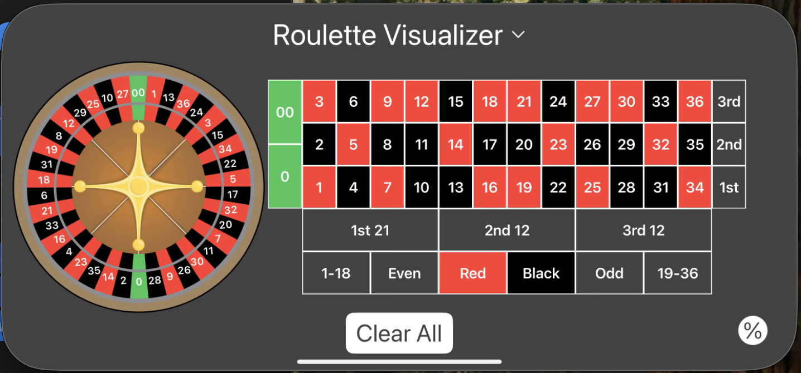

  # 🎡 Roulette Visualizer

  ### See exactly where your bets land — before the wheel spins

  
  
  
  
  

---

## Overview

**Roulette Visualizer** is an iOS app that makes it easy to understand and visualize roulette bets. Select any combination of bets and instantly see exactly which numbers and sections of the wheel they cover — no guesswork, no mental math. A built-in odds and payout reference keeps everything you need in one place.

---

## Screenshots

  

---

## Features

- 🎯 **Interactive Betting Grid** — Tap any inside or outside bet to highlight the numbers it covers, both on the grid and the wheel
- 🎡 **Live Wheel Visualization** — See your selected bets reflected in real time directly on the roulette wheel
- 📊 **Odds & Payout Reference** — A dedicated view breaks down the payout and probability for every bet type
- 🗑️ **Clear All** — Reset your entire selection instantly with a single tap
- 🌑 **Dark UI** — Clean, focused design built for low-light casino environments

---

## Requirements

- iOS 16.7 or later
- iPhone or iPad

---

## Built With

- **Swift** — Native iOS development
- **SwiftUI** — UI framework
- **Xcode** — Primary IDE

---

## Contact

Questions or feedback?

📬 [stuckbykev@gmail.com](mailto:stuckbykev@gmail.com)

---

## License

© 2026 Kevin. All Rights Reserved.

This project is not open source. No portion of this codebase may be reproduced, copied, modified, or distributed in any form without explicit written permission from the author.
